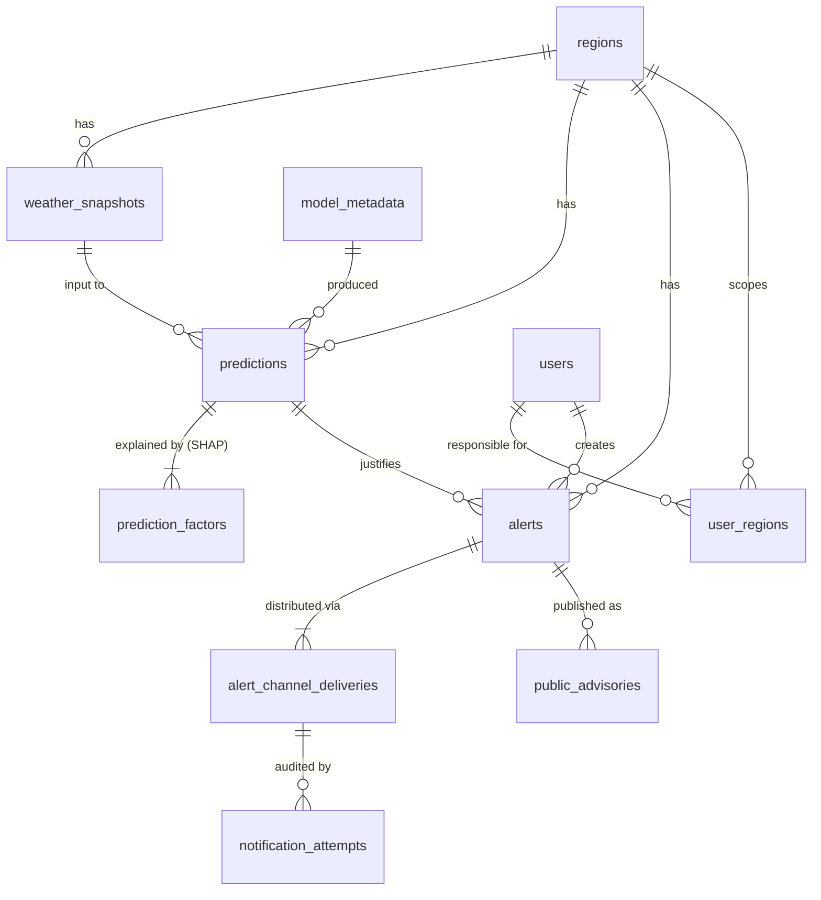

# Database (Part 08)

SQLite, one file, the sole source of truth for everything the dashboard shows. The schema is written so that moving to PostgreSQL is a port, not a redesign (§8).

| | |
|---|---|
| Schema (migrations) | [`backend/src/heatwave_api/db/migrations/`](../../backend/src/heatwave_api/db/migrations/) — `0001_initial_schema.sql`, `0002_notifications.sql` (Part 09) |
| Data access | [`db/repository.py`](../../backend/src/heatwave_api/db/repository.py): `SqliteRepository` (the API's `Repository` protocol) and `SqliteUserStore` |
| Migration runner / CLI | [`db/migrate.py`](../../backend/src/heatwave_api/db/migrate.py), `uv run heatwave-db …` ([`db/cli.py`](../../backend/src/heatwave_api/db/cli.py)) |
| File location | `DATABASE_URL` (default `sqlite:///data/local/heatwave.db`, relative to the repo root; tests use `sqlite:///:memory:`) |
| Backups | `DATABASE_BACKUP_DIR` (default `data/local/backups`) |
| Decision record | [ADR 0007](../decisions/0007-database.md) |

## 1. Entity-relationship summary



- One region has many weather snapshots, predictions and alerts.
- One prediction has many `prediction_factors` (its ranked SHAP breakdown, one row per factor) and optionally many alerts that cite it.
- One alert has one `alert_channel_deliveries` row per selected channel.
- One user creates many alerts, and may be scoped to regions through `user_regions`.
- `alert_sequences` (alert-id counter per year) and `schema_migrations` (applied migrations) are bookkeeping, not entities.

## 2. Tables

Conventions everywhere: timestamps are UTC ISO-8601 text in one fixed format (`2026-10-07T09:30:00.000000+00:00`), so they sort and compare correctly as text; dates are `YYYY-MM-DD`; booleans are `0/1`; enumerations are `TEXT` with a `CHECK` using exactly the API's spelling. Foreign keys are real constraints (§7).

### `regions`
| Column | Type | Constraints / notes |
|---|---|---|
| `region_id` | TEXT | PK, lowercase id (`mumbai`, `kurla`, …) — the API's `region.id` |
| `name`, `district`, `state`, `zone` | TEXT | NOT NULL. `district` is the coarser grouping |
| `lat`, `lon` | REAL | NOT NULL, range-checked. Used for weather-source lookups |
| `is_active` | INTEGER | 0/1, default 1 |
| `created_at`, `updated_at` | TEXT | |

Upserted from `config/regions.yaml` at every startup and by `heatwave-db seed`. The YAML file stays the source of truth (Part 02); the table exists so everything else can reference a region with a foreign key.

### `weather_snapshots`
| Column | Type | Constraints / notes |
|---|---|---|
| `snapshot_id` | INTEGER | PK |
| `region_id` | TEXT | FK → regions |
| `valid_date` | TEXT | the date the readings describe |
| `lead_days` | INTEGER | 0–3 (0 for historical actuals) |
| `kind` | TEXT | `HISTORICAL` (observed actuals) / `FORECAST` (current/forecast, used for live prediction) |
| `source` | TEXT | `imd`, `nasa_power`, `open_meteo`, `synthetic`, … (traceability to Part 02) |
| `issued_at` | TEXT | when the source issued it |
| `tmax_c`, `normal_tmax_c`, `rh_pct`, `wind_ms`, `solar_mj_m2`, `precip_mm` | REAL | nullable (a missing reading stays missing); range checks on rh/wind/solar/precip |
| `recorded_at` | TEXT | when it was written here |

Unique on `(region_id, valid_date, lead_days, source, issued_at)`: the same issued reading is stored once. Written (a) by every prediction, as the `FORECAST` snapshot it used, and (b) by `heatwave-db import-weather` for history.

### `model_metadata`
| Column | Type | Constraints / notes |
|---|---|---|
| `model_version` | TEXT | PK, e.g. `xgboost-20260928T100821Z-0bde51` (Part 05) |
| `model_family`, `explainer_id`, `labeling_rule_version` | TEXT | |
| `test_rows`, `accuracy`, `precision_macro`, `recall_macro`, `f1_macro` | INTEGER / REAL | held-out metrics, 0–1 checked |
| `performance_json` | TEXT | the full `ModelPerformance` block (per-class scores, calibration) |
| `is_active` | INTEGER | exactly one row is 1 (partial unique index) |
| `first_seen_at`, `activated_at` | TEXT | |

Written at startup with the model the service actually loaded, so it always matches what is serving. `GET /api/v1/analytics` reads "Model Performance" from here. Earlier versions stay, inactive, because old predictions reference them.

### `users` and `user_regions`
| Column | Type | Constraints / notes |
|---|---|---|
| `user_id` | TEXT | PK |
| `username` | TEXT | UNIQUE |
| `password_hash` | TEXT | must look like `scrypt$<salt>$<digest>` — a plain-text password is rejected by `CHECK` |
| `display_name` | TEXT | |
| `role` | TEXT | `viewer` / `official` / `admin` (Part 15 decides what each may do) |
| `is_active` | INTEGER | inactive users cannot sign in |
| `created_at`, `updated_at` | TEXT | |

`user_regions (user_id, region_id)` lists the regions an account is responsible for; no rows means unscoped. Part 15 owns the rule. The demo account (`user_demo`) is seeded only for `APP_ENV=local|test`, and is **deactivated** when the service starts in any other environment, so a database copied from a laptop never carries a known password into staging.

### `predictions` (append-only)
| Column | Type | Constraints / notes |
|---|---|---|
| `prediction_id` | TEXT | PK (`pred_…`) |
| `created_at` | TEXT | when the prediction was made |
| `region_id` | TEXT | FK → regions |
| `weather_snapshot_id` | INTEGER | FK → weather_snapshots (the conditions used) |
| `model_version` | TEXT | FK → model_metadata |
| `explainer_id` | TEXT | Part 06 explainer artifact |
| `valid_date`, `lead_days`, `horizon_days`, `forecast_issued_at` | | forecast window (lead 0–3; horizon 3) |
| `risk_class` | TEXT | `NORMAL` / `HEATWAVE` / `SEVERE_HEATWAVE` |
| `confidence` | REAL | 0–1 |
| `prob_normal`, `prob_heatwave`, `prob_severe_heatwave` | REAL | one column per class, so analytics can aggregate them |
| `inputs_json` | TEXT | the raw input values the model was given (a copy, so the record is stable even if a snapshot is corrected) |
| `explanation_json` | TEXT | explanation header (target/reference class, baseline, output, summary); the factors are rows below |
| `recommended_actions_json`, `actions_version` | TEXT | the actions shown, and which rule-set version produced them |
| `weather_source`, `weather_issued_at`, `weather_age_hours`, `weather_stale` | | provenance as returned to the client |

### `prediction_factors` (append-only)
| Column | Type | Constraints / notes |
|---|---|---|
| `prediction_id` | TEXT | FK → predictions; PK with `rank` |
| `rank` | INTEGER | 1 = largest absolute contribution |
| `feature`, `label`, `unit` | TEXT | machine name and display label (Part 06's label table) |
| `value`, `display_value`, `imputed` | | the value used, formatted, and whether it was imputed |
| `contribution` | REAL | signed SHAP contribution |
| `share_pct` | REAL | share of total absolute contribution (bar width) |
| `direction` | TEXT | `increases_risk` / `decreases_risk` / `neutral` |

A stored prediction reads back **identical** to the API response that created it (tested: `test_predictions_are_append_only_and_round_trip_exactly`).

### `alerts`
| Column | Type | Constraints / notes |
|---|---|---|
| `alert_id` | TEXT | PK, `HW-<year>-<seq:04d>` (e.g. `HW-2026-0007`), from `alert_sequences` |
| `region_id` | TEXT | FK → regions |
| `prediction_id` | TEXT | FK → predictions, nullable: the "why" behind the alert |
| `severity` | TEXT | `HEATWAVE` / `SEVERE_HEATWAVE` |
| `status` | TEXT | `DRAFT` / `READY` / `ISSUED` |
| `message` | TEXT | the public advisory, 10–1000 characters |
| `created_by` | TEXT | FK → users |
| `client_request_id` | TEXT | idempotency key; `UNIQUE (created_by, client_request_id)` makes replay detection atomic |
| `created_at`, `updated_at` | TEXT | |
| `issued_at` | TEXT | NULL until issued; `CHECK` ties it to `status = 'ISSUED'` |

Once `ISSUED`, a trigger refuses any change to status, severity, message, region, prediction or `issued_at`, and refuses deletion. Only `updated_at` moves while channel results are written back.

### `alert_channel_deliveries`
| Column | Type | Constraints / notes |
|---|---|---|
| `alert_id` | TEXT | FK → alerts (cascade); PK with `channel` |
| `channel` | TEXT | stable id from `config/alert_channels.yaml` (`public_mobile`, `government_portal`, `display_boards`, `emergency_services`, `hospitals`) |
| `label` | TEXT | the label at the time ("Public Mobile Alert", …) |
| `position` | INTEGER | the order the official listed them in |
| `status` | TEXT | `READY` / `NOTIFIED` / `PENDING` / `FAILED` |
| `detail` | TEXT | why a delivery failed |
| `updated_at` | TEXT | last change |

Part 09's dispatch job writes each channel's outcome here as it lands (`AlertService.deliver` → `update_delivery`, which also moves `alerts.updated_at` so pollers see progress). A new channel type is a row in the YAML file, not a schema change.

### `notification_attempts` (append-only, migration 0002, Part 09)
| Column | Type | Constraints / notes |
|---|---|---|
| `attempt_id` | INTEGER | PK, insertion order |
| `alert_id`, `channel` | TEXT | FK → `alert_channel_deliveries (alert_id, channel)` |
| `mechanism` | TEXT | `sms` / `email` / `in_app` |
| `provider` | TEXT | `twilio`, `sendgrid`, `mock-sms`, `mock-email`, `in_app`, `none` (no recipients) |
| `recipient` | TEXT | phone/email; NULL for in_app |
| `attempt` | INTEGER | 1-based try number for that recipient |
| `outcome` | TEXT | `SUCCESS` / `TRANSIENT_FAILURE` / `PERMANENT_FAILURE` |
| `detail`, `provider_ref` | TEXT | sanitised error; provider message id (for delivery receipts) |
| `started_at`, `duration_ms` | TEXT / INTEGER | |

Triggers refuse UPDATE and DELETE. Index `(alert_id, channel, attempt_id)` serves `GET /alerts/{id}/attempts`. See [docs/notifications](../notifications/README.md) §7.

### `public_advisories` (migration 0002, Part 09)
| Column | Type | Constraints / notes |
|---|---|---|
| `advisory_id` | INTEGER | PK |
| `alert_id` | TEXT | FK → alerts; `UNIQUE (alert_id, channel)` so a resumed job cannot publish twice |
| `channel` | TEXT | `government_portal` / `display_boards` |
| `region_id` | TEXT | FK → regions |
| `severity`, `title`, `body` | TEXT | rendered from the in_app template |
| `published_at` | TEXT | index `(region_id, published_at)` serves `GET /advisories` |

## 3. Indexes

| Index | Serves |
|---|---|
| `ix_predictions_region_created (region_id, created_at)` | trend over time per region (analytics) |
| `ix_predictions_region_lead_created (region_id, lead_days, created_at)` | "latest prediction per region" (dashboard; verified by `EXPLAIN QUERY PLAN` in the tests) |
| `ix_predictions_created (created_at)` | all-region analytics windows |
| `ix_weather_snapshots_region_date (region_id, valid_date)` | weather history per region |
| `ix_alerts_status (status)`, `ix_alerts_region (region_id)` | "all issued alerts", "alerts for this region" |
| `ix_alerts_created (created_at)` | the newest-first alert list |
| PK `(alert_id, channel)` on deliveries | per-alert status lookup (the PK's leading column is the index the plan asks for) |
| `ix_alert_channel_deliveries_status (status)` | "which deliveries failed" (Part 09 retries) |
| `ix_prediction_factors_feature (feature)` | "how often is X the top driver" (Part 14) |

## 4. Cross-check against the UI specs (Parts 11–14)

| Screen element | Source |
|---|---|
| **Dashboard (11)** region table: Area, Temperature, Risk | `regions.name`, `predictions.inputs_json.tmax_c`, `predictions.risk_class` (latest per region via the index above) |
| Dashboard metric cards (temperature, humidity, risk, alerts) | latest prediction's inputs/risk; `alerts` count by status |
| Dashboard "Why this prediction?" (top 2–3 factors) | `prediction_factors` rank ≤ 3 |
| Dashboard Recommended Authority Actions | `predictions.recommended_actions_json` (+ `actions_version`) |
| Stale-but-labelled data | `weather_issued_at`, `weather_age_hours`, `weather_stale` |
| **Prediction page (12)** risk banner: class, region, probability, "Next 1–3 days" | `risk_class`, `region_id`, `confidence` / `prob_*`, `valid_date` + `lead_days` + `horizon_days` |
| Input cards: Max Temp, Humidity, Wind, Temp Deviation | `inputs_json` (`tmax_c`, `rh_pct`, `wind_ms`, `temp_deviation_c`) — the exact values the model saw, never recomputed |
| Full SHAP panel with signed bars (incl. negative) | every `prediction_factors` row: `contribution` (signed), `share_pct`, `direction`, `label`, `display_value` |
| "AI EXPLAINED" / "DEMO DATA" tags | `explainer_id` / `model_version`; `weather_source` (`synthetic` = demo) |
| **Alerts page (13)** Alert ID, created date, severity, region, status | `alerts.alert_id`, `created_at`, `severity`, `region_id`, `status` |
| Issued date / read-only issued view | `issued_at`, plus the issued-alert trigger |
| Created by | `alerts.created_by` → `users.display_name` |
| Alert Distribution: five channels with status pills | `alert_channel_deliveries` (`label`, `status`, `detail`, `updated_at`, ordered by `position`) |
| Public Advisory text | `alerts.message` |
| Link back to the prediction's explanation | `alerts.prediction_id` → `predictions` → `prediction_factors` |
| Response Coordination panel | **Open (Part 13 decides).** If it reuses the channel mechanism, internal parties become channel ids in `config/alert_channels.yaml` — no schema change. If it is a separate tracker, it needs a new table via migration `0002` |
| **Analytics (14)** temperature trend | `predictions` (newest per region-day) today; `weather_snapshots` `HISTORICAL` rows for longer history |
| Risk distribution | `predictions.risk_class` counts over the period |
| Heatwave events per month (with severity) | `predictions` per region-day with `HEATWAVE` / `SEVERE_HEATWAVE` (the API's counting rule, docs/api §3.5) |
| Model Performance panel | `model_metadata` active row |
| Period selector | `created_at` / `valid_date` ranges on the indexed columns |

Nothing a screen shows lives only in a cache or in frontend state: every value above is a column in this database.

## 5. Retention and historical integrity

- **Predictions and their factors are never updated or deleted.** Triggers enforce it (`RAISE(ABORT, 'predictions are append-only')`). This is the record the analytics trends are computed from, and the "why" behind every alert.
- **Issued alerts are frozen and cannot be deleted** (trigger). A wrong warning is corrected by issuing a new alert.
- Draft/ready alerts may be edited. Weather snapshots are deduplicated by the unique key and not otherwise deleted.
- Volume is small (5 regions × a few predictions a day ≈ a few MB a year), so there is no purge job. If one is ever needed it must be a migration with an explicit decision, not an ad-hoc `DELETE`.

### Backups

The database file is the only copy of predictions and alerts, so back it up even at mini-project scale:

```sh
uv run heatwave-db backup               # -> DATABASE_BACKUP_DIR/heatwave-<UTC stamp>.db, keeps the newest 14
uv run heatwave-db backup --keep 30 --dest /mnt/backup/heatwave
```

- Uses SQLite's online backup API, which takes a consistent copy while the API keeps running (a plain file copy of a WAL-mode database can miss committed pages), then runs `PRAGMA integrity_check` on the copy.
- Schedule it daily (cron / Task Scheduler / the deploy platform's scheduler — Part 18) and copy the backup directory off the host.
- Always back up immediately before `heatwave-db migrate` in a deployed environment.
- Restore: stop the API, copy a backup file over `heatwave.db` (and delete any `heatwave.db-wal` / `-shm` next to it), start the API. Startup verifies the migration state.

## 6. Migrations

Numbered SQL files, `NNNN_<name>.sql` in `backend/src/heatwave_api/db/migrations/`, applied in order by `db/migrate.py`, recorded in `schema_migrations` with a SHA-256 checksum.

- Each migration runs in **one transaction with its bookkeeping row**: if it fails, nothing changes.
- An applied migration that has been **edited** is refused (checksum mismatch). Never edit an applied file; add `0002_…`.
- A database **newer** than the code (a migration the code does not have) is refused: deploy the newer code, never hand-roll the database back.
- Numbering must be contiguous (`0001`, `0002`, …).

**Local development and tests** (`APP_ENV=local|test`, or any in-memory database): the API applies pending migrations at startup. Nothing to remember.

**Deployed (staging/production, Part 18):** the API **refuses to start** while migrations are pending. The deploy step is explicit:

```sh
uv run heatwave-db backup
uv run heatwave-db migrate
uv run heatwave-db status        # version, pending (none), row counts
# then start / restart the API
```

Writing a new migration: add the next-numbered file; keep to the portability rules in §8; add a test in `backend/tests/test_database.py`; record it in the Part's log.

## 7. SQLite-specific decisions

- **Foreign keys are enforced.** SQLite ignores them unless enabled per connection; `db/connection.py` enables them and then checks the pragma reads back `1`, failing loudly otherwise (tested).
- **WAL journal mode**, `synchronous=NORMAL`, `busy_timeout=5000` for file databases: readers (backups, `heatwave-db status`) never block the writer.
- **Single writer, consciously.** SQLite allows one writer at a time. The API holds one connection behind a lock, so its writes are serialised in-process. For a handful of authority users this is far from a bottleneck. It is also the named reason to move to PostgreSQL: **more than one API process/host writing, or sustained concurrent writes**.
- **The file path comes from configuration** (`DATABASE_URL`, Part 01), never code: `data/local/heatwave.db` locally, a mounted volume in deployment, `:memory:` in tests (an autouse fixture guarantees tests never touch the real file).

## 8. Moving to PostgreSQL later

The schema already avoids SQLite-only constructs except the triggers. The port is:

| SQLite here | PostgreSQL |
|---|---|
| `TEXT` ISO timestamps / dates | `TIMESTAMPTZ` / `DATE` |
| `INTEGER` 0/1 + `CHECK` | `BOOLEAN` |
| `TEXT` + `CHECK (x IN …)` | same, or native `ENUM` |
| `INTEGER PRIMARY KEY` | `BIGINT GENERATED ALWAYS AS IDENTITY` |
| `*_json TEXT` | `JSONB` |
| `GLOB` checks | `~` regex checks |
| `RAISE(ABORT, …)` triggers | `plpgsql` trigger functions |
| `ON CONFLICT … DO UPDATE`, `RETURNING`, partial index | identical syntax |

Code-wise: a `PostgresRepository` implementing the same `Repository` protocol, selected by the `DATABASE_URL` scheme (`connection.resolve_sqlite_path` currently rejects anything that is not `sqlite:///`). Routers and services do not change.
